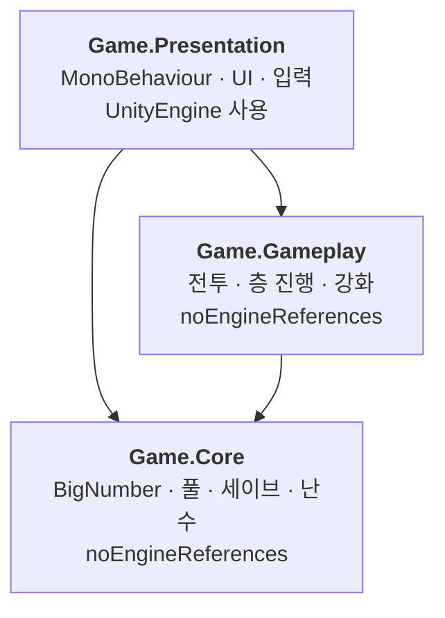
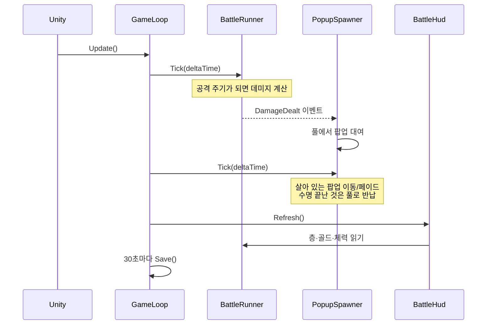

# 시스템 구조

지금 코드베이스에 **실제로 존재하는 것**을 설명하는 문서.
목표 설계는 `Docs/GDD.md`에 있고, 이 문서는 구현된 것만 다룬다. 시스템이 추가될 때마다 갱신한다.

기준 시점: W5(스탯 강화) 완료.

---

## 1. 전체 그림



의존은 **위에서 아래로만** 흐른다. 역방향은 asmdef가 컴파일 단계에서 막는다.
자세한 것은 `Docs/AssemblyDefinitions.md`.

**아래 두 계층은 `UnityEngine`을 쓸 수 없다.** 그래서 게임 로직 전체가 씬도 PlayMode도 없이
EditMode 테스트로 검증된다. 지금 109개가 이 방식으로 돈다.

---

## 2. 계층별 책임

### Game.Core — 게임을 몰라도 되는 것들

| 타입 | 역할 |
|---|---|
| `BigNumber` | 가수 + 무제한 지수. `double` 한계(약 1e308)를 넘는 수치 |
| `ObjectPool<T>` | 인스턴스 재사용. 이중 반납을 예외로 잡는다 |
| `IRandomSource` / `SystemRandomSource` | 난수 주입점. 테스트에서 치명타를 고정하기 위함 |
| `SaveData` | 세이브 파일에 직렬화되는 데이터 |
| `SaveStore` | 원자적 쓰기, 체크섬, 버전 마이그레이션 |

여기 있는 것들은 이 게임에 대해 아무것도 모른다. 층도 골드도 모른다.

### Game.Gameplay — 규칙

| 타입 | 역할 |
|---|---|
| `BattleRunner` | 자동 전투. 공격 주기, 처치, 층 진행, 보스, 골드 |
| `CharacterStats` | 공격력 · 공속 · 치명타 확률/배율 |
| `DamageResult` | 한 번의 타격 결과 (데미지, 치명타 여부) |
| `BattleProgress` | 층 · 처치수 · 골드의 스냅샷. 저장/복원 단위 |
| `FloorFormula` | 층별 몬스터 체력과 골드 보상 |
| `StatUpgrade` | 강화 하나. 단계 → 비용/효과 |
| `StatUpgrades` | 골드를 차감하고 단계를 올린다 |
| `EquipmentDefinition` | 장비 한 종류의 정의 (슬롯·등급·값) |
| `EquipmentTable` | 존재하는 장비 전부. id로 찾는다 |
| `Inventory` | 보유 목록과 슬롯별 착용 상태 |
| `StatComposer` | **강화 + 장비를 합쳐 전투 스탯을 만든다.** `CharacterStats`의 유일한 작성자 |

### Game.Presentation — 화면

| 타입 | 역할 |
|---|---|
| `GameLoop` | 진입점. 조립 · 매 프레임 진행 · 자동 저장 |
| `BattleHud` | 층 · 골드 · 처치수 · 체력바 · 보스 타이머 |
| `DamagePopup` | 떠오르며 사라지는 데미지 숫자 하나 |
| `DamagePopupSpawner` | 팝업 대여/반납, 살아 있는 팝업 갱신 |
| `StatUpgradeButton` | 강화 하나를 사는 버튼 |
| `DebugPanel` | 개발용 버튼 모음. 배포 빌드에서는 스스로 꺼진다 |

---

## 3. 한 프레임에 일어나는 일



**씬에서 `Update`를 가진 컴포넌트는 `GameLoop` 하나뿐이다.**
데미지 팝업은 수십 개가 동시에 존재하는데, 각자 `Update`를 두면 엔진의 개별 호출 비용이
개수만큼 곱해진다. 그래서 스포너가 자기 리스트를 직접 돈다.

---

## 4. 데이터가 흐르는 두 방향

**아래로 (명령):** `GameLoop` → `BattleRunner.Tick()`, `StatUpgrades.TryPurchase()`

**위로 (통지):** `BattleRunner`의 평범한 C# 이벤트 (`DamageDealt`, `MonsterKilled`)

UI가 매 프레임 읽어도 되는 값(층, 골드, 체력)은 **이벤트 없이 그냥 읽는다.**
이벤트는 그 순간 놓치면 사라지는 것(타격, 처치)에만 쓴다.

`BattleHud`와 `StatUpgradeButton`은 **값이 바뀐 항목만** 다시 그린다.
매 프레임 문자열을 만들면 그대로 GC 부하가 되기 때문이다.

---

## 5. 지켜지는 규칙 세 가지

1. **게임 로직은 `UnityEngine`을 모른다.** 필요해 보이면 그 코드가 Presentation에 속한다는 신호다.
2. **`Update`는 `GameLoop`에만 있다.** 매 프레임 갱신이 필요하면 `GameLoop`이 호출해준다.
3. **상태를 바꾸는 경로는 하나씩만 둔다.** 골드는 `TrySpendGold`로만 줄고, 강화 단계는
   `StatUpgrades.TryPurchase`로만 오른다(`StatUpgrade`의 변경 메서드는 `internal`).
   **`CharacterStats`에 값을 쓰는 것은 `StatComposer`뿐이다** — 강화와 장비가 같은 스탯에
   기여하므로 각자 대입하면 서로를 덮어쓴다. 그래서 구매와 착용도 `StatComposer`가 감싼다.

---

## 6. 세이브

```
Application.persistentDataPath/save.json

<체크섬>\n<JSON 페이로드>
```

- **원자적 쓰기** — 임시 파일에 쓰고 교체한다. 저장 중 앱이 죽어도 기존 파일이 남는다
- **체크섬** — FNV-1a. 손상과 손쉬운 변조를 걸러낸다. 암호학적 강도는 아니다
- **마이그레이션** — 한 번에 다음 버전으로만 옮기는 루프. 현재 v2 (v1 → v2: 강화 단계 추가)
- **저장 시점** — 30초마다 / 백그라운드 전환 / 종료

**수치가 아니라 단계를 저장한다.** 밸런싱 수식을 바꿔도 기존 세이브가 새 수식을 따른다.

---

## 7. 일부러 만들지 않은 것

GDD에 있지만 아직 호출자가 없어 만들지 않았다. 각각 만들 시점이 정해져 있다.

| 항목 | 왜 아직 없나 | 언제 |
|---|---|---|
| **EventBus** | 생산자 1개, 소비자 3개라 평범한 C# 이벤트로 충분하다 | 서로 참조가 없는 시스템이 3개 이상 얽힐 때 (W6~W8) |
| **TickManager** | 매 프레임 갱신 대상이 2개뿐이다. 팝업은 스포너가 직접 돈다 | 독립 등록이 필요한 대상이 많아질 때 |
| **데이터 테이블 (CSV→SO)** | 밸런싱 상수가 `FloorFormula.Default` / `StatUpgrades.CreateDefault` 두 곳에 모여 있다 | 장비·정령처럼 항목 수가 많아질 때 (W6) |
| **MVP 패턴** | 화면이 하나고 버튼이 2개다 | 화면이 탭으로 나뉠 때 |

**호출자가 생겼을 때 만든다.** 지금 만들면 API를 추측으로 짜고 나중에 갈아엎게 된다.

### 지금 알고 있는 구조 부채

`StatUpgrades`(Progression)가 `BattleRunner`(Combat)를 참조하는데 `BattleRunner`도
`FloorFormula`(Progression)를 참조한다. **네임스페이스 수준의 순환**이다.
어셈블리 경계는 멀쩡해서 문제가 되진 않는다.
골드를 쓰는 시스템이 세 번째로 생기면 `BattleRunner`에서 골드를 떼어내 해소한다.

---

## 8. 파일 지도

```
Assets/_Project/
├── Core/                        Game.Core (순수 C#)
│   ├── BigNumber.cs
│   ├── ObjectPool.cs
│   ├── IRandomSource.cs
│   └── Save/
│       ├── SaveData.cs
│       └── SaveStore.cs
├── Gameplay/                    Game.Gameplay (순수 C#)
│   ├── Combat/
│   │   ├── BattleRunner.cs
│   │   ├── BattleProgress.cs
│   │   ├── CharacterStats.cs
│   │   └── DamageResult.cs
│   ├── Equipment/
│   │   ├── EquipmentDefinition.cs
│   │   ├── EquipmentTable.cs
│   │   └── Inventory.cs
│   └── Progression/
│       ├── FloorFormula.cs
│       ├── StatUpgrade.cs
│       ├── StatUpgrades.cs
│       └── StatComposer.cs
├── Presentation/                Game.Presentation (UnityEngine)
│   ├── GameLoop.cs
│   ├── BattleHud.cs
│   ├── DamagePopup.cs
│   ├── DamagePopupSpawner.cs
│   └── StatUpgradeButton.cs
├── Tests/EditMode/
│   ├── Core/                    Game.Core.Tests
│   └── Gameplay/                Game.Gameplay.Tests
├── Fonts/                       Pretendard (한글 폴백)
└── Prefabs/                     DamagePopup
```

## 관련 문서

- `Docs/GDD.md` — 목표 설계, 밸런싱 수식, 12주 일정
- `Docs/AssemblyDefinitions.md` — asmdef 사용법
- `Docs/SceneSetup.md` — 씬 배치 절차
